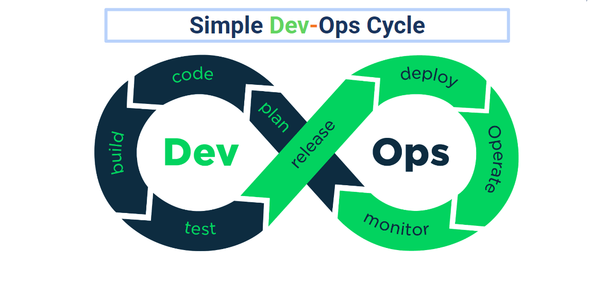

# (23) Compute Services

## Resume Materi

### System & Software Deployment

Deployment adalah kegiatan yang bertujuan untuk menyebarkan aplikasi/produk yang telah dikerjakan oleh para pengembang seringkali untuk mengubah dari status sementara ke permanen.Penyebarannya dapat melalui beragam cara tergantung dari jenis aplikasinya, aplikasi web & api ke server sedangkan aplikasi mobile ke Playstore/Appstore.

### Strategi Deployment

Ada 4 Strategi Deployment yag sering digunakan yaitu:

- Big-Bang Deployment Strategy atau sering disebut Replace
- Deployment Strategy
- Rollout Deployment Strategy
- Blue/Green Deployment Strategy
- Canary Deployment Strategy

### Simple Dev-Ops Cycle

### AWS EC2

Amazon Elastic Compute Cloud (Amazon EC2) adalah layanan web yang memberikan kapasitas komputasi yang aman dan berukuran fleksibel di cloud. EC2 menawarkan banyak opsi untuk membangun dan menjalankan hampir semua aplikasi. Dengan kemungkinan ini, EC2 bisa dimulai dengan cepat dan mudah. Halaman ini memberi sumber daya untuk membantu memulai instans EC2. Amazon Elastic Compute Cloud (Amazon EC2) menawarkan platform komputasi terluas dan terdalam, dengan lebih dari 500 instans dan pilihan prosesor, penyimpanan, jaringan, sistem pengoperasian, dan model pembelian terbaru untuk membantu menyesuaikan dengan kebutuhan beban kerja.

### RDS (Relational Database Service)

Amazon Relational Database Service (Amazon RDS) adalah layanan pengelolaan RDBMS (relational database) dari AWS (Amazon Web Services). ini adalah kumpulan layanan terkelola yang mempermudah penyiapan, pengoperasian, dan penskalaan basis data di cloud. Software yang didukung antara lain:

- MySQL
- MariaDB
- Microsoft SQL
- Oracle
- PostgreSQL
- Aurora (dibuat oleh AWS, kompatibel dengan MySQL dan PostgreSQL)
